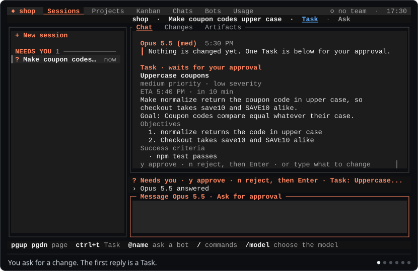
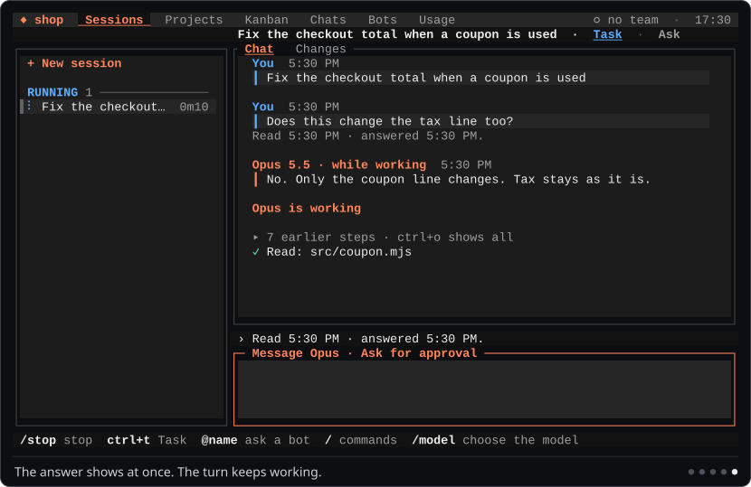
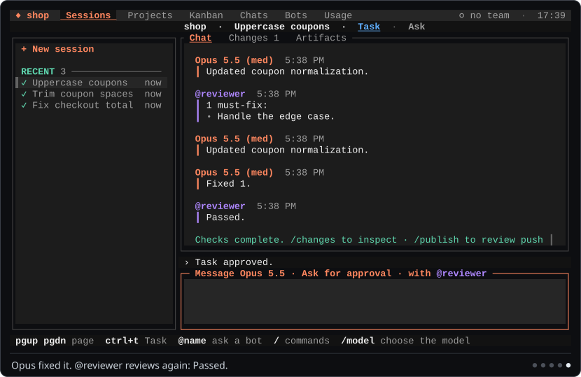
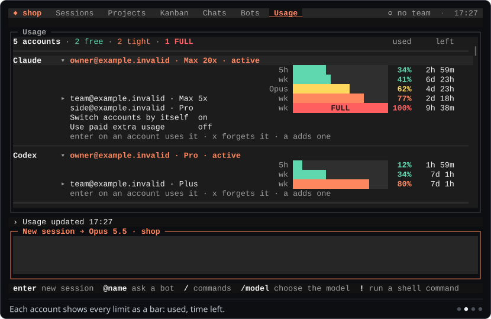

# ELU

A full-screen terminal app that runs coding sessions on the AI command lines you already
use, with bots that review and do work, and teammates you can ask.


## Install

From your home folder, not inside a project you do not trust:

```sh
npx -y @elu-labs/elu
```

This opens ELU and installs the `elu` command; next time you type `elu`. To install
a given version, name it: `npx -y @elu-labs/elu@0.1.12`.

You need macOS or Linux, Node 22 or newer, Git, Claude Code signed in, and Codex installed
(no sign-in needed; its sandbox runs your project's checks):
`npm install --global @openai/codex`. Using Antigravity? Read
[its page](docs/vendors/antigravity.md) first. More in [Install](docs/install.md).

## Start

```sh
elu
```

The first start asks for a project name; later starts open your last project. Type a
message and press Enter. That starts a session: the model answers, or edits in a new Git
worktree on its own branch.

## Features

### Tasks

Ask for a change and the first reply is a Task: its goal, its objectives and a checklist of the work. Approve it and the work starts; where keep going is on (`/keepgoing`), ELU starts the session again by itself until the objectives are met.



### Replies while it works

Write to a session while it works: its answer shows at once under your message, with a line such as `Read 12:45 PM · answered 12:46 PM.`



### Bots

Add a bot to a session: `@reviewer` reviews each change, and `@lead` plans the work and hands the pieces to helpers.



### Models and agents

Change the model, the vendor or the effort in the middle of a session: `/model` picks another model, and `/agent change` sets a model's effort.


### Long jobs

Work that takes longer than a turn runs as a job, and when the job ends ELU starts the session again by itself.


### Artifacts

A session's Artifacts tab shows charts and tables that track the numbers its Task asked to see.


### Usage

The Usage tab lists your vendor accounts and how much of each limit is used.



### Your computers and your team

Share a project with your other computers and your teammates: every computer on it sees its sessions and can write to them, and they share one Kanban board.


### Publishing

Nothing is pushed until you type `/publish` and confirm, unless you give a session Full access. `/permissions` sets what a session may do without asking.


## More

- [Install](docs/install.md): what you need, the vendors, the default model, the sandbox for checks.
- [Sessions](docs/sessions.md): the tabs, the chat, messages while a session works, worktrees.
- [Tasks](docs/tasks.md): what a Task holds, approving it, its card on the Kanban.
- [Commands and keys](docs/commands.md): the commands, schedules, `elu` from a shell or a session, the keys.
- [Long jobs](docs/jobs.md): jobs that outlive a turn, and keep going.
- [Permissions](docs/permissions.md): the modes, approvals, rules, MCP servers, the never list.
- [Bots](docs/bots.md): the five that come with the app, and making your own.
- [Teammates](docs/teammates.md): teams, invites, shared projects, your own computers. The wire format is in [docs/peer-network.md](docs/peer-network.md).
- [Standup](docs/standup.md): an update from every open session.
- [Usage](docs/usage.md): accounts, limits, costs, `/budget`.
- [Vendors](docs/vendors): Claude Code, Codex, Antigravity and Grok Build.
- [Security](SECURITY.md): what is trusted, and what an agent may do.

## Update and remove

Quit ELU with `/quit` in every terminal it is open in, then run `elu update`. To remove
ELU, follow [Update and remove](docs/update.md): it says what to stop first and what stays.

## Help and contributing

- A question or a bug: [open an issue](https://github.com/ELU-Labs/elu/issues).
- A security problem: report it privately, as [SECURITY.md](SECURITY.md) says.
- A change to the code: [CONTRIBUTING.md](CONTRIBUTING.md).

## Credits and license

MIT licensed. Sponsored by [ELU](https://elu.dev).

`@reviewer` is adapted from the code-review skill in Anthropic's knowledge-work-plugins
(Apache-2.0), and `@qa` from the qa skill in gstack by Garry Tan (MIT). The examples in
`test/fixtures/a2a/` come from the A2A specification (Apache-2.0). See
[THIRD_PARTY_NOTICES.md](THIRD_PARTY_NOTICES.md).
